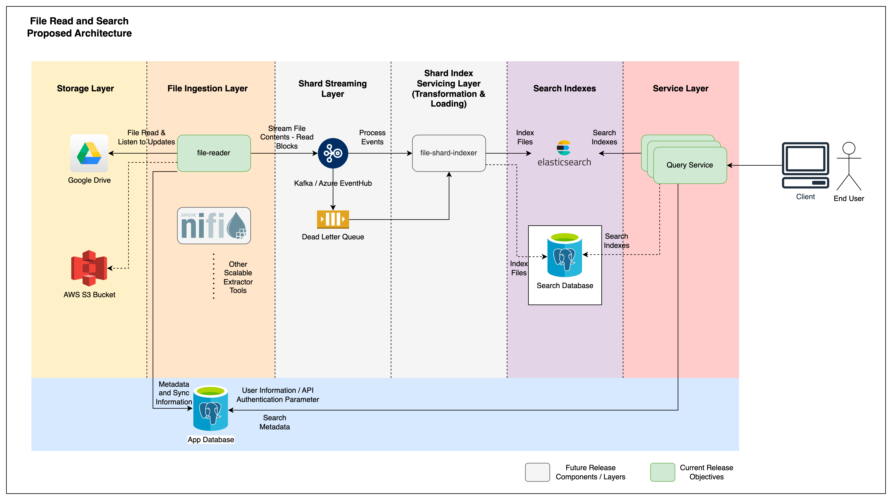
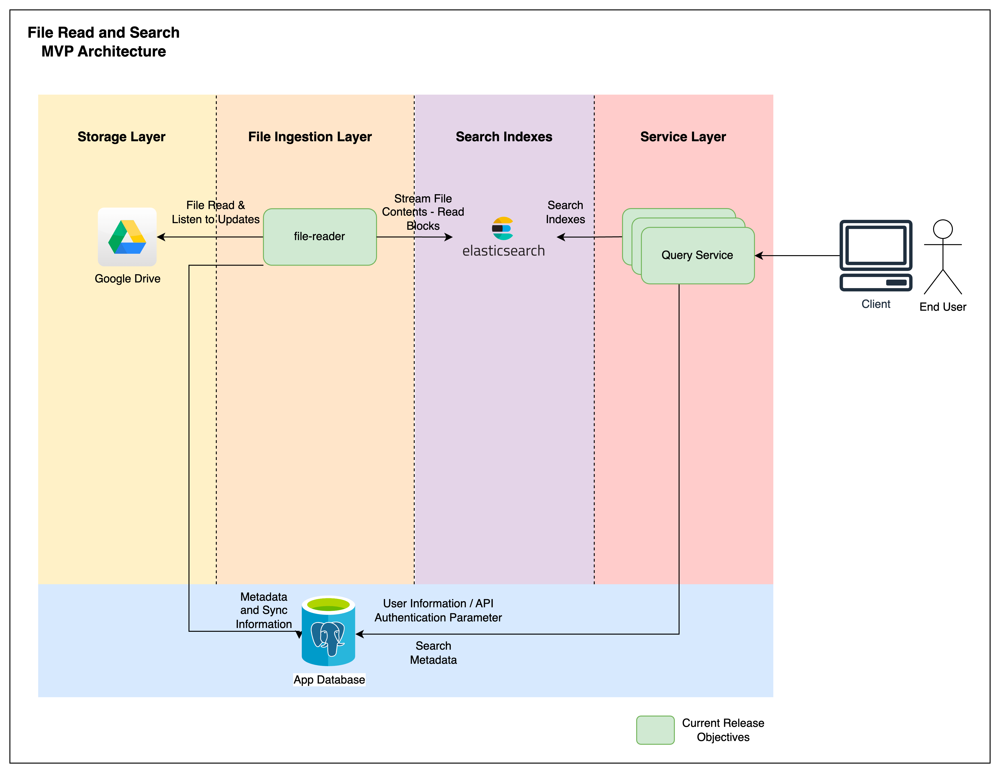

# High Level Design

The design follows the approach of modularity,
creates the layers such that each layer is scalable
independently, cost can be managed by scaling these
components either up or down as the situation demands.

## Proposed Architecture Diagram

## Components / Design Principles

### Storage Layer:
1. Can be one of Google Drive, Dropbox, AWS S3 etc.
2. The raw data source of the files.

### App Database:
1. The solution specific RDBMS.
2. Remembers context of file reads.
3. Use for highly available configuration of file-reader service
   if it is scheduled for execution.

### File Ingestion Layer:
1. Either a custom developed or an available tooling service that reads
   files from the storage.
2. File contents are streamed to an external streaming layer, this is to
   facilitate reading of files in chunks.
3. The file reading service may optionally make use of the app
   database to remember the context and store the metadata as needed.

### Shard Streaming Layer:
1. This layer is to facilitate any stream based processing of the data.
2. Example: shard may be applied as a transformation logic
   such that it generates the new index for the same file
   as it passes through the stream.
3. A dead letter queue can be added to avoid data processing loss.

### Shard Index Servicing Layer:
1. The layer that would otherwise makes the decision of either creating
   a new shard in case if using the postgres, or decides if we need to
   use a new index for elasticsearch.

### Search Indexes
1. A storage/indexing layer. Note that this is not a replication layer.
2. A reverse indexing is applied for the extensive search capability.

### Service Layer
1. A service layer that facilitates user requests.

### Client
1. A client that can execute API requests.

## MVP Architecture

